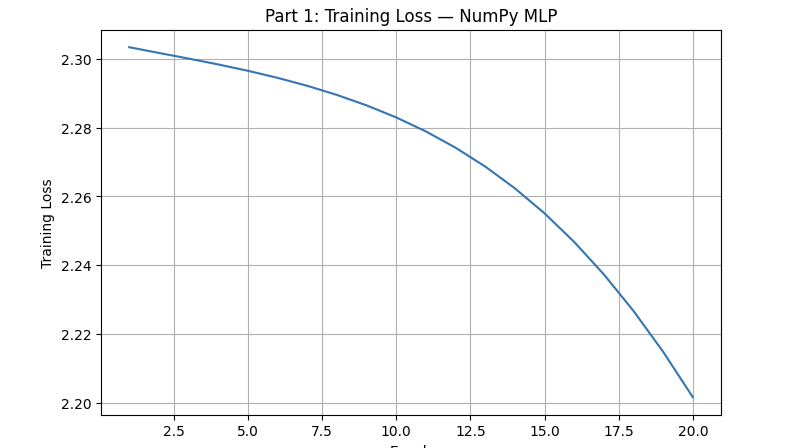
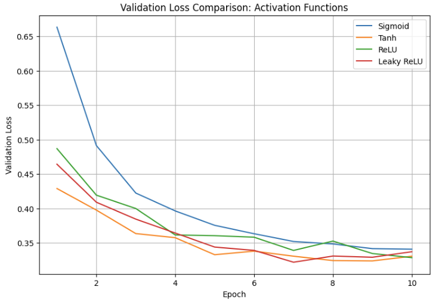
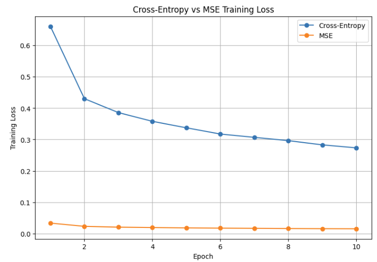
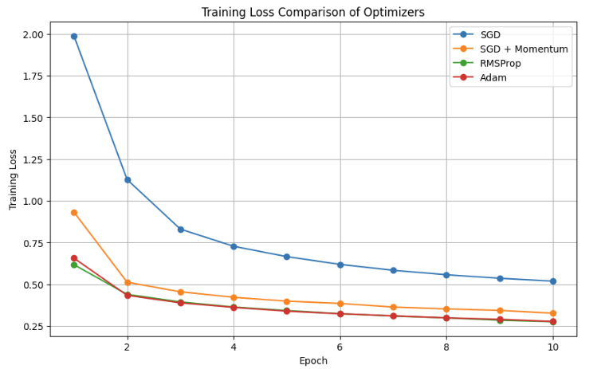
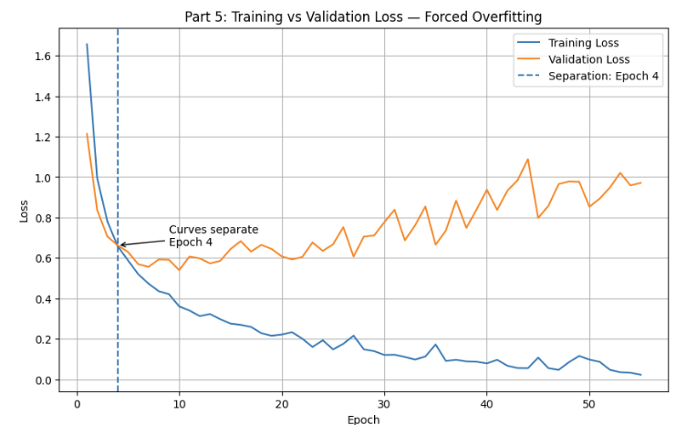
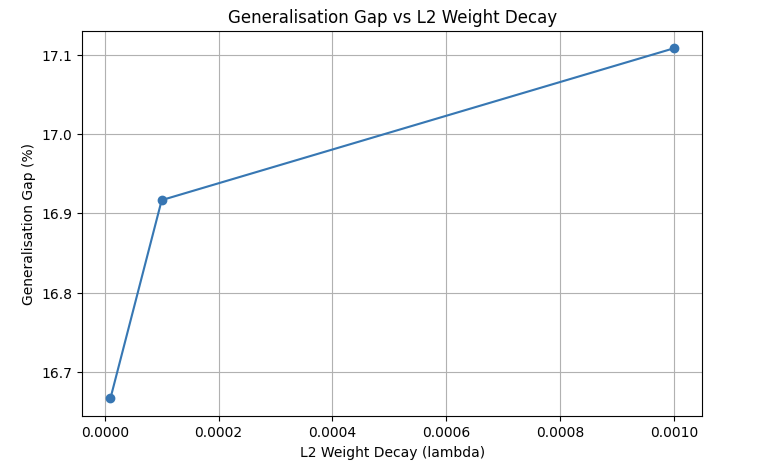
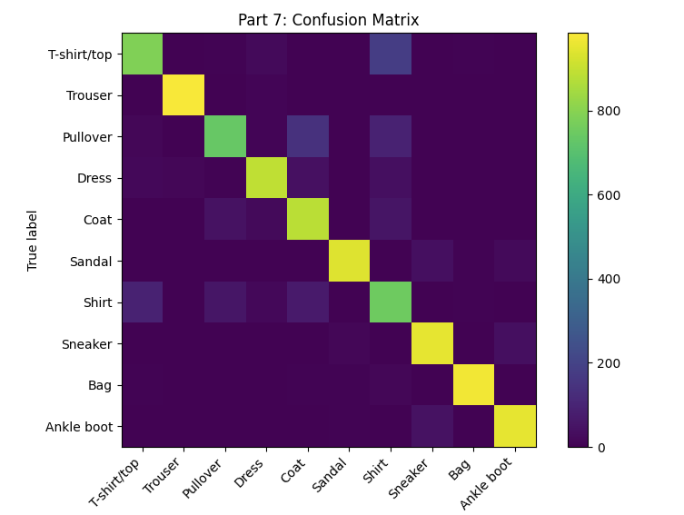

# Fashion-MNIST Neural Network Experiments

This project contains a complete set of neural network experiments using the **Fashion-MNIST dataset**.

The assignment starts with implementing a neural network and backpropagation from scratch using NumPy. It then uses PyTorch to study activation functions, loss functions, optimizers, overfitting, regularization, and hyperparameter tuning.

## Repository Contents

* `DLP_A1_23F_0696_23F_0696.ipynb` — Complete notebook containing the code, experiments, results, plots, and explanations.
* `README.md` — Project information and instructions.
* `IMAGES/` — Important graphs and results from the experiments.

## Dataset

The project uses the **Fashion-MNIST dataset** provided by Zalando Research.

The dataset contains:

* 60,000 training images
* 10,000 test images
* 10 different clothing classes
* Images of size 28 × 28 pixels

The pixel values are normalized from **0–255 to 0–1** before training.

## Experiments

### Part 1 — Backpropagation from Scratch

A neural network with the architecture:

**784 → 64 → 10**

was implemented using NumPy without using an automatic differentiation framework.

The implementation includes:

* ReLU activation
* Softmax
* Cross-entropy loss
* Forward propagation
* Backpropagation
* Manual gradient descent

The manually calculated gradients were compared with PyTorch autograd to verify the implementation.



---

### Part 2 — Activation Functions

A common neural network architecture was used to compare:

* Sigmoid
* Tanh
* ReLU
* Leaky ReLU

Their validation performance and gradient behavior were studied.

ReLU achieved the best validation accuracy in this experiment at approximately **88.19%**.



---

### Part 3 — Loss Functions

Two loss functions were compared for Fashion-MNIST classification:

* Cross-Entropy Loss
* Mean Squared Error (MSE)

A separate neural network was also trained on the **California Housing dataset** for regression using MSE, RMSE, and MAE.

Cross-entropy was more suitable for the classification task because it provided better learning behavior than MSE.



---

### Part 4 — Optimizers

Four optimizers were compared:

* SGD
* SGD with Momentum
* RMSProp
* Adam

Both common and tuned learning rates were tested.

Adam performed best in our experiment, reaching 85% validation accuracy in **2 epochs** and achieving a final validation accuracy of **88.12%**.



---

### Part 5 — Forced Overfitting

The model was intentionally made more likely to overfit by:

* Using only 2,000 training samples
* Using a larger neural network
* Training for multiple epochs

Training and validation performance were monitored to observe the **generalization gap**.



---

### Part 6 — Regularization

Several techniques were tested to reduce overfitting:

* L2 regularization
* L1 regularization
* Dropout
* Batch normalization
* Early stopping
* Data augmentation
* Increasing the training dataset size

The results were compared to see which methods helped improve generalization.



---

### Part 7 — Hyperparameter Tuning

A random search was performed to find a better combination of:

* Learning rate
* Hidden layer size
* Dropout rate

The selected configuration was:

* **Learning rate:** 0.0005
* **Hidden width:** 256
* **Dropout:** 0.2

The final model achieved approximately **88.36% test accuracy** and approximately **88.44% macro F1-score**.



## Main Results

| Part   | Main Finding                                                         |
| ------ | -------------------------------------------------------------------- |
| Part 1 | NumPy backpropagation closely matched PyTorch autograd               |
| Part 2 | ReLU achieved approximately 88.19% validation accuracy               |
| Part 3 | Cross-entropy was more suitable for classification                   |
| Part 4 | Adam achieved the best optimizer performance                         |
| Part 5 | A clear training-validation generalization gap was observed          |
| Part 6 | Regularization and more training data helped reduce overfitting      |
| Part 7 | Hyperparameter tuning selected LR 0.0005, width 256, and dropout 0.2 |

## How to Run

### Using Kaggle

The easiest way to run the notebook is through Kaggle.

1. Open a Kaggle Notebook.
2. Add the Fashion-MNIST dataset using **Add Input**.
3. Upload the `.ipynb` notebook or copy its cells.
4. Run the notebook cells in order.

The dataset should be available at:

```text
/kaggle/input/datasets/zalando-research/fashionmnist
```

A GPU is recommended for faster execution, especially for the later experiments.

### Running Locally

Install the required libraries:

```bash
pip install numpy pandas matplotlib scikit-learn torch torchvision jupyter
```

Download the Fashion-MNIST dataset and update the dataset path in the notebook.

Then open the notebook:

```bash
jupyter notebook
```

Run the cells **from top to bottom**, since later experiments depend on variables and models created earlier.

## Class Labels

| Label | Class       |
| ----: | ----------- |
|     0 | T-shirt/top |
|     1 | Trouser     |
|     2 | Pullover    |
|     3 | Dress       |
|     4 | Coat        |
|     5 | Sandal      |
|     6 | Shirt       |
|     7 | Sneaker     |
|     8 | Bag         |
|     9 | Ankle boot  |

## Technologies Used

* Python
* NumPy
* pandas
* scikit-learn
* PyTorch
* torchvision
* Matplotlib
* Jupyter Notebook

## Dataset Attribution

This project uses the **Fashion-MNIST dataset** created by Zalando Research.

Dataset source: Kaggle — Zalando Research
